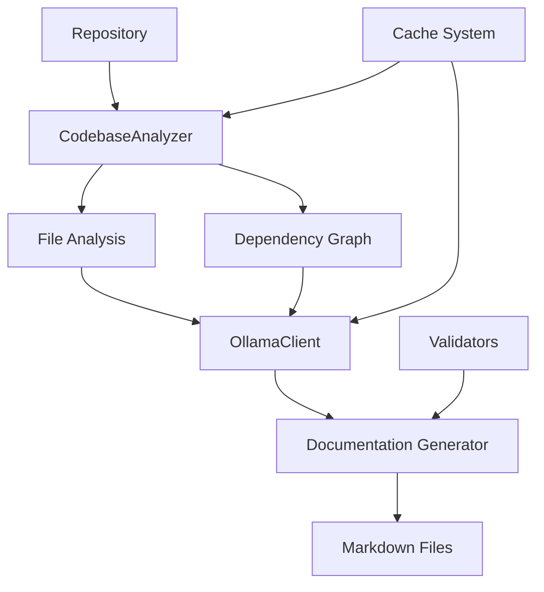
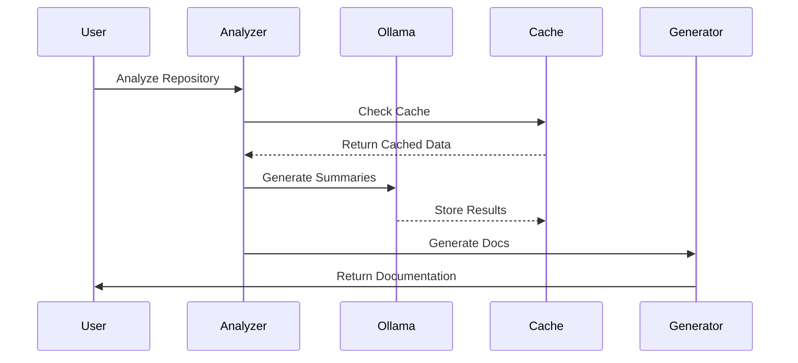
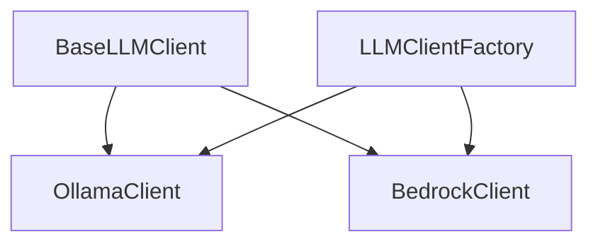
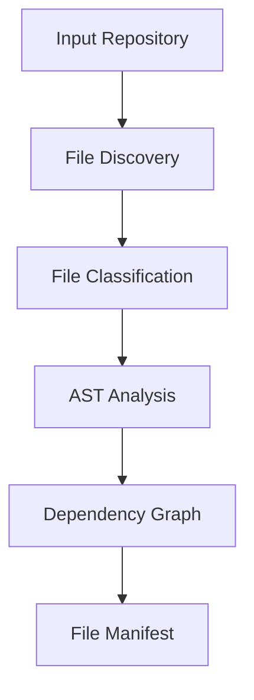
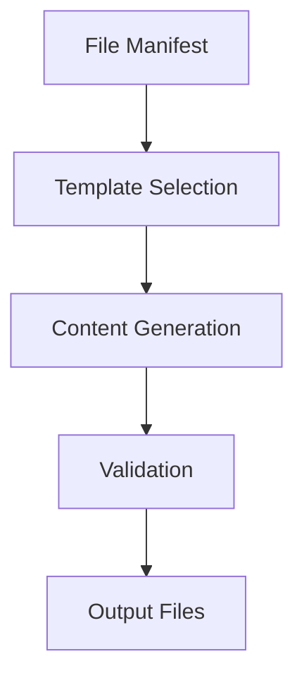

# Architecture Guide

This document provides a detailed overview of the AI README Generator's architecture, design decisions, and system interactions.

## Table of Contents
- [System Overview](#system-overview)
- [Core Components](#core-components)
- [Data Flow](#data-flow)
- [Design Patterns](#design-patterns)
- [Performance Considerations](#performance-considerations)
- [Security](#security)
- [Extensibility](#extensibility)
- [Project Structure](#project-structure)

## System Overview

### High-Level Architecture



### Key Components Interaction



## Core Components

### 1. CodebaseAnalyzer
The central component for repository analysis.

#### Responsibilities
- Repository traversal
- File classification
- AST parsing
- Dependency tracking
- Import/export detection
- Project name derivation
- Markdown header validation

#### Implementation
```python
class CodebaseAnalyzer:
    """Analyzes repository structure and content.
    
    This class is responsible for scanning a repository, analyzing its files,
    and building a comprehensive file manifest with metadata. It handles gitignore
    rules, binary file detection, and can extract information about exports and
    dependencies from source code files.
    """
    
    # Constants for file types and special directories
    BINARY_MIME_PREFIXES = ('text/', 'application/json', 'application/xml')
    SOURCE_CODE_EXTENSIONS = {'.py', '.js', '.ts', '.cs', '.java'}
    SPECIAL_FILES = {"README.md", "ARCHITECTURE.md", "CONTRIBUTING.md"}
    SPECIAL_DIRS = {".github"}
    
    def __init__(self, repo_path: Path, config: dict):
        self.repo_path = Path(repo_path).absolute()
        self.config = config
        self.file_manifest: Dict[str, FileInfo] = {}
        self.graph = nx.DiGraph()
```

#### Key Methods
- `analyze_repository()`: Main entry point for repository analysis
- `should_include_file()`: Unified method for determining file inclusion
- `build_dependency_graph()`: Creates a graph of file dependencies
- `derive_project_name()`: Intelligently determines project name from repository
- `analyze_python_files()`: Specialized analysis for Python files

### 2. LLM Clients
Handles all AI model interactions through a common interface.

#### Architecture


#### Responsibilities
- Model communication
- Context management
- Response processing
- Error handling
- Retry logic
- Token counting and management

#### Implementation
```python
class BaseLLMClient(ABC):
    """Base abstract class for LLM clients."""
    
    VERSION = "1.0.0"
    
    def __init__(self):
        """Initialize the base client."""
        self.token_counter = None
        self.project_structure = None
    
    @abstractmethod
    async def initialize(self) -> None:
        """Initialize the client."""
        pass
        
    @abstractmethod
    def init_token_counter(self) -> None:
        """Initialize the token counter for this client."""
        pass
        
    # Other abstract methods for generating content
```

#### Concrete Implementations
```python
class OllamaClient(BaseLLMClient):
    def __init__(self, config: Dict[str, Any]):
        super().__init__()
        self.base_url = config.get('ollama', {}).get('base_url', 'http://localhost:11434')
        self.max_tokens = config.get('ollama', {}).get('max_tokens', 4096)
        # ...

class BedrockClient(BaseLLMClient):
    def __init__(self, config: Dict[str, Any]):
        super().__init__()
        self.region = os.getenv('AWS_REGION') or config.get('bedrock', {}).get('region', 'us-east-1')
        self.model_id = os.getenv('AWS_BEDROCK_MODEL_ID') or config.get('bedrock', {}).get('model_id')
        # ...
```

### 3. Cache System
Multi-level caching system.

#### Architecture


#### Implementation
```python
class CacheManager:
    def __init__(self):
        self.memory_cache = MemoryCache()
        self.disk_cache = SQLiteCache()
```

## Data Flow

### 1. Repository Analysis


### 2. Documentation Generation


## Design Patterns

### 1. Factory Pattern
Used for creating different types of analyzers and generators.

```python
class AnalyzerFactory:
    @staticmethod
    def create_analyzer(file_type: str) -> BaseAnalyzer:
        if file_type == 'python':
            return PythonAnalyzer()
        # ... other analyzers
```

### 2. Strategy Pattern
Used for different processing strategies.

```python
class ProcessingStrategy(ABC):
    @abstractmethod
    def process(self, content: str) -> str:
        pass

class ChunkedProcessing(ProcessingStrategy):
    def process(self, content: str) -> str:
        # Process in chunks
```

### 3. Observer Pattern
Used for progress tracking and event handling.

```python
class ProgressTracker:
    def __init__(self):
        self.observers: List[ProgressObserver] = []

    def notify_progress(self, progress: float):
        for observer in self.observers:
            observer.update(progress)
```

## Performance Considerations

### 1. Memory Management
- Streaming file processing
- Chunk-based handling
- Automatic garbage collection
- Memory usage monitoring

### 2. Caching Strategy
- Multi-level cache
- TTL-based invalidation
- Size-based limits
- Intelligent prefetching

### 3. Parallel Processing
- Async operations
- Worker pools
- Rate limiting
- Resource management

### Test Mode
- Processes first 5 non-ignored files
- Bypasses cache validation
- Disables parallel processing
- Provides quick validation of core functionality

## Security

### 1. Local Processing
All processing is done locally to ensure:
- Data privacy
- Network isolation
- Resource control
- Access management

### 2. Input Validation
- File type verification
- Content sanitization
- Path traversal prevention
- Size limits

### 3. Output Validation
- Link verification
- Content validation
- Format checking
- Security scanning

## Extensibility

### 1. Plugin System
```python
class Plugin(ABC):
    @abstractmethod
    def initialize(self, config: Dict):
        pass

    @abstractmethod
    def process(self, content: str) -> str:
        pass
```

### 2. Custom Analyzers
```python
class CustomAnalyzer(BaseAnalyzer):
    def analyze(self, content: str) -> AnalysisResult:
        # Custom analysis logic
```

### 3. Template System
```python
class TemplateManager:
    def __init__(self, template_dir: Path):
        self.template_dir = template_dir
        self.templates: Dict[str, Template] = {}
```

## Project Structure

The codebase follows a modular structure with clear separation of concerns:

```
src/
├── analyzers/          # Code analysis tools
│   └── codebase.py     # Repository analysis
├── clients/            # External service clients
│   └── ollama.py       # Ollama API integration
├── generators/         # Content generation
│   ├── readme.py       # README generation
│   └── mermaid.py      # Mermaid diagram generation
├── models/            # Data models
│   └── file_info.py   # File information
└── utils/             # Utility functions
    ├── cache.py       # Caching system
    ├── github_utils.py # GitHub integration utilities
    ├── badges.py      # Badge generation utility
    └── [other utility modules]
```

### Directory Purposes

- **analyzers/**: Contains tools for analyzing repository structure and code relationships
- **clients/**: Manages external service interactions, particularly with Ollama
- **generators/**: Handles generation of documentation files
- **models/**: Defines data structures and types
- **utils/**: Houses utility functions and helper modules

## Future Considerations

### 1. Scalability
- Distributed processing
- Cloud integration
- Microservices architecture
- Load balancing

### 2. Integration
- CI/CD pipelines
- IDE plugins
- Git hooks
- API endpoints

### 3. Enhancement
- Additional languages
- More documentation types
- Advanced analytics
- Custom workflows

# Project Architecture

## Overview
The AI README Generator is a Python-based tool that analyzes codebases and generates comprehensive documentation using local AI models.

## Project Structure
```
src/
├── analyzers/          # Code analysis tools
│   └── codebase.py     # Repository analysis
├── clients/            # External service clients
│   └── ollama.py       # Ollama API integration
├── generators/         # Content generation
│   ├── readme.py       # README generation
│   └── mermaid.py      # Mermaid diagram generation
├── models/            # Data models
│   └── file_info.py   # File information
└── utils/             # Utility functions
    ├── cache.py       # Caching system
    ├── badges.py      # Badge generation utility
    └── [other utility modules]
```

## Project Index
<details open>
    <summary><b>Repository Structure</b></summary>
    <blockquote>
        <table>
        <tr>
            <td><b><code>.github/</code></b></td>
            <td>GitHub-specific configuration files and workflows</td>
        </tr>
        <tr>
            <td><b><code>src/</code></b></td>
            <td>Source code for the project</td>
        </tr>
        <tr>
            <td><b><code>tests/</code></b></td>
            <td>Test suite and test fixtures</td>
        </tr>
        <tr>
            <td><b><code>docs/</code></b></td>
            <td>Project documentation</td>
        </tr>
        </table>
    </blockquote>
</details>

## File Filtering

The project implements intelligent file filtering that can be configured via:

```yaml
blacklist:
  extensions: [".md", ".txt", ".log"]
  path_patterns: 
    - "/temp/"
    - "/cache/"
    - "/node_modules/"
    - "/__pycache__/"
```

### Included Files
- All regular source code files
- Documentation files
- Configuration files
- `.github` directory contents
- Essential project files (README, LICENSE, etc.)

### Excluded Files
- Files matching blacklisted extensions (configurable)
- Paths matching blacklisted patterns (configurable)
- Hidden files/directories (except `.github`)
- Build directories (bin, obj, dist, build)
- Cache directories
- Package manager directories (node_modules, venv)
- Binary/compiled files
- IDE configuration directories
- Temporary files

This filtering ensures that generated documentation focuses on the essential project components while excluding unnecessary technical artifacts