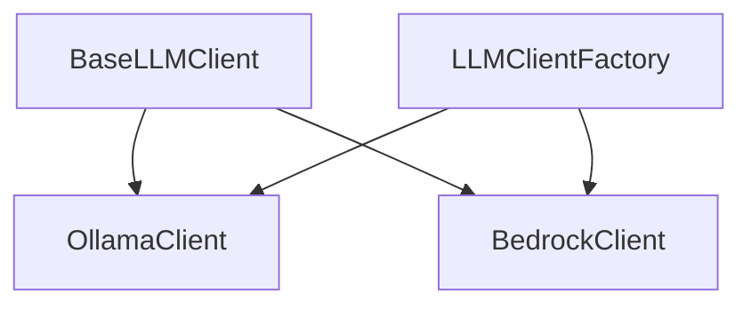

# LLM Clients

This document provides detailed information about the LLM (Large Language Model) clients used in the Codebase Scribe AI project.

## Table of Contents
- [Overview](#overview)
- [BaseLLMClient](#basellmclient)
- [OllamaClient](#ollamaclient)
- [BedrockClient](#bedrockclient)
- [LLMClientFactory](#llmclientfactory)
- [Usage Examples](#usage-examples)
- [Extending with New Providers](#extending-with-new-providers)

## Overview

The LLM clients provide a unified interface for interacting with different language model providers. The system uses an abstract base class (`BaseLLMClient`) that defines the interface, with concrete implementations for specific providers like Ollama and AWS Bedrock.



## BaseLLMClient

The `BaseLLMClient` is an abstract base class that defines the interface for all LLM clients. It provides a common set of methods that must be implemented by concrete subclasses.

### Key Features

- Version tracking for API compatibility
- Input validation methods
- Token counting and management
- Comprehensive documentation with examples
- Type hints for better IDE support

### Core Methods

```python
class BaseLLMClient(ABC):
    """
    Base abstract class for LLM clients.
    
    This class defines the interface that all LLM client implementations must follow.
    It provides abstract methods for interacting with language models to generate
    documentation and analyze code.
    
    Version: 1.0.0
    """
    
    VERSION = "1.0.0"
    
    def __init__(self):
        """Initialize the base client."""
        self.token_counter = None
        self.project_structure = None
    
    @abstractmethod
    async def initialize(self) -> None:
        """Initialize the client."""
        pass
    
    @abstractmethod
    def init_token_counter(self) -> None:
        """Initialize the token counter for this client."""
        pass
    
    def validate_input(self, text: str) -> bool:
        """Validate input text before sending to the LLM."""
        if not text or not isinstance(text, str):
            return False
        return True
    
    def validate_file_manifest(self, file_manifest: Dict[str, Any]) -> bool:
        """Validate the file manifest structure."""
        if not isinstance(file_manifest, dict):
            return False
        return True
    
    @abstractmethod
    async def generate_summary(self, prompt: str) -> Optional[str]:
        """Generate a summary for a file's content."""
        pass
    
    # ... other abstract methods
```

## OllamaClient

The `OllamaClient` is a concrete implementation of `BaseLLMClient` that interacts with the Ollama API for local LLM processing.

### Key Features

- Local model execution
- Interactive model selection
- Automatic token management
- Retry logic for resilience
- Progress tracking

### Implementation Details

```python
class OllamaClient(BaseLLMClient):
    """Handles all interactions with local Ollama instance."""
    
    def __init__(self, config: Dict[str, Any]):
        super().__init__()
        
        # Get Ollama config with defaults
        ollama_config = config.get('ollama', {})
        self.base_url = ollama_config.get('base_url', 'http://localhost:11434')
        self.max_tokens = ollama_config.get('max_tokens', 4096)
        self.retries = ollama_config.get('retries', 3)
        self.retry_delay = ollama_config.get('retry_delay', 1.0)
        self.timeout = ollama_config.get('timeout', 30)
        self.temperature = ollama_config.get('temperature', 0)
        self.client = AsyncClient(host=self.base_url)
        self.prompt_template = PromptTemplate(config.get('template_path'))
        self.debug = config.get('debug', False)
        self.available_models = []
        self.selected_model = None
```

## BedrockClient

The `BedrockClient` is a concrete implementation of `BaseLLMClient` that interacts with AWS Bedrock for enterprise-grade LLM processing.

### Key Features

- AWS Bedrock integration
- Environment variable support
- SSL verification configuration
- Concurrency control
- Automatic token management

### Implementation Details

```python
class BedrockClient(BaseLLMClient):
    """Handles all interactions with AWS Bedrock."""
    
    def __init__(self, config: Dict[str, Any]):
        super().__init__()
        
        # Load environment variables from .env file
        load_dotenv()
        
        # Get Bedrock config with defaults
        bedrock_config = config.get('bedrock', {})
        
        # Use environment variables if available, otherwise use config
        self.region = os.getenv('AWS_REGION') or bedrock_config.get('region', 'us-east-1')
        self.model_id = os.getenv('AWS_BEDROCK_MODEL_ID') or bedrock_config.get(
            'model_id', 'us.anthropic.claude-3-5-sonnet-20241022-v2:0'
        )
```

## LLMClientFactory

The `LLMClientFactory` is responsible for creating the appropriate LLM client based on configuration.

### Implementation

```python
class LLMClientFactory:
    """Factory for creating LLM clients."""
    
    @staticmethod
    async def create_client(config: Dict[str, Any]) -> BaseLLMClient:
        """Create and initialize an LLM client based on configuration."""
        provider = config.get('llm_provider', 'ollama').lower()
        
        if provider == 'bedrock':
            try:
                client = BedrockClient(config)
                await client.initialize()
                return client
            except Exception as e:
                print(f"Error initializing Bedrock client: {e}")
                print("Falling back to Ollama client...")
                provider = 'ollama'
        
        # Default to Ollama
        client = OllamaClient(config)
        await client.initialize()
        return client
```

## Usage Examples

### Basic Usage

```python
# Create and initialize an LLM client
config = {
    'llm_provider': 'ollama',
    'ollama': {
        'base_url': 'http://localhost:11434',
        'max_tokens': 4096
    }
}

# Create the client using the factory
llm_client = await LLMClientFactory.create_client(config)

# Generate a summary for a file
summary = await llm_client.generate_summary("def hello(): print('Hello world')")

# Generate project overview
overview = await llm_client.generate_project_overview(file_manifest)
```

### Using AWS Bedrock

```python
# Configure for AWS Bedrock
config = {
    'llm_provider': 'bedrock',
    'bedrock': {
        'region': 'us-east-1',
        'model_id': 'us.anthropic.claude-3-5-sonnet-20241022-v2:0'
    }
}

# Create the client using the factory
llm_client = await LLMClientFactory.create_client(config)

# Use the client as before
summary = await llm_client.generate_summary("def hello(): print('Hello world')")
```

## Extending with New Providers

To add a new LLM provider:

1. Create a new class that inherits from `BaseLLMClient`
2. Implement all abstract methods
3. Add the new provider to the `LLMClientFactory`

Example:

```python
class NewProviderClient(BaseLLMClient):
    """Handles interactions with a new LLM provider."""
    
    def __init__(self, config: Dict[str, Any]):
        super().__init__()
        # Initialize with provider-specific configuration
        
    async def initialize(self) -> None:
        # Implementation
        pass
        
    def init_token_counter(self) -> None:
        # Implementation
        pass
        
    # Implement other abstract methods
```

Then update the factory:

```python
@staticmethod
async def create_client(config: Dict[str, Any]) -> BaseLLMClient:
    provider = config.get('llm_provider', 'ollama').lower()
    
    if provider == 'bedrock':
        # Existing Bedrock code
    elif provider == 'new_provider':
        client = NewProviderClient(config)
        await client.initialize()
        return client
    
    # Default to Ollama
    client = OllamaClient(config)
    await client.initialize()
    return client