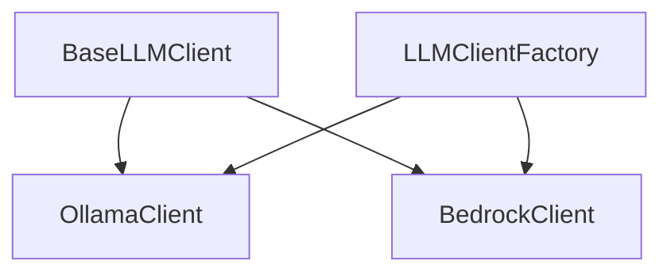

# LLM Clients

This document provides detailed information about the LLM (Large Language Model) clients used in the Codebase Scribe AI project.

## Table of Contents
- [Overview](#overview)
- [BaseLLMClient](#basellmclient)
- [OllamaClient](#ollamaclient)
- [BedrockClient](#bedrockclient)
- [LLMClientFactory](#llmclientfactory)
- [LLM Utilities](#llm-utilities)
- [Usage Examples](#usage-examples)
- [Extending with New Providers](#extending-with-new-providers)

## Overview

The LLM clients provide a unified interface for interacting with different language model providers. The system uses an abstract base class (`BaseLLMClient`) that defines the interface, with concrete implementations for specific providers like Ollama and AWS Bedrock.



## BaseLLMClient

The `BaseLLMClient` is an abstract base class that defines the interface for all LLM clients. It provides a common set of methods that must be implemented by concrete subclasses.

### Key Features

- Version tracking for API compatibility
- Input validation methods
- Token counting and management
- Comprehensive documentation with examples
- Type hints for better IDE support

### Core Methods

```python
class BaseLLMClient(ABC):
    """
    Base abstract class for LLM clients.
    
    This class defines the interface that all LLM client implementations must follow.
    It provides abstract methods for interacting with language models to generate
    documentation and analyze code.
    
    Version: 1.0.0
    """
    
    VERSION = "1.0.0"
    
    def __init__(self):
        """Initialize the base client."""
        self.token_counter = None
        self.project_structure = None
    
    @abstractmethod
    async def initialize(self) -> None:
        """Initialize the client."""
        pass
    
    @abstractmethod
    def init_token_counter(self) -> None:
        """Initialize the token counter for this client."""
        pass
    
    def validate_input(self, text: str) -> bool:
        """Validate input text before sending to the LLM."""
        if not text or not isinstance(text, str):
            return False
        return True
    
    def validate_file_manifest(self, file_manifest: Dict[str, Any]) -> bool:
        """Validate the file manifest structure."""
        if not isinstance(file_manifest, dict):
            return False
        return True
    
    @abstractmethod
    async def generate_summary(self, prompt: str) -> Optional[str]:
        """Generate a summary for a file's content."""
        pass
    
    # ... other abstract methods
```

## OllamaClient

The `OllamaClient` is a concrete implementation of `BaseLLMClient` that interacts with the Ollama API for local LLM processing.

### Key Features

- Local model execution
- Interactive model selection
- Automatic token management
- Retry logic for resilience
- Progress tracking
- Comprehensive error handling
- Token limit management

### Implementation Details

```python
# Constants for default configuration values
DEFAULT_BASE_URL = "http://localhost:11434"
DEFAULT_MAX_TOKENS = 4096
DEFAULT_RETRIES = 3
DEFAULT_RETRY_DELAY = 1.0
DEFAULT_TIMEOUT = 30
DEFAULT_TEMPERATURE = 0

class OllamaClient(BaseLLMClient):
    """
    Client for interacting with local Ollama LLM instances.
    
    This class handles all interactions with a local Ollama instance, including
    model selection, token management, and generating various types of documentation.
    
    Attributes:
        base_url (str): URL of the Ollama API endpoint
        max_tokens (int): Maximum number of tokens for responses
        retries (int): Number of retries for API calls
        retry_delay (float): Delay between retries in seconds
        timeout (int): Timeout for API calls in seconds
        temperature (float): Temperature for LLM generation (0-1)
        client (AsyncClient): Ollama API client
        prompt_template (PromptTemplate): Template manager for prompts
        debug (bool): Whether to print debug information
        available_models (list): List of available models
        selected_model (str): Currently selected model
        token_counter (TokenCounter): Counter for token usage
        project_structure (str): String representation of project structure
    """
    
    def __init__(self, config: Dict[str, Any]):
        """
        Initialize the Ollama client.
        
        Args:
            config: Configuration dictionary with Ollama-specific settings
        """
        super().__init__()
        
        # Get Ollama config with defaults
        ollama_config = config.get('ollama', {})
        self.base_url = ollama_config.get('base_url', DEFAULT_BASE_URL)
        self.max_tokens = ollama_config.get('max_tokens', DEFAULT_MAX_TOKENS)
        self.retries = ollama_config.get('retries', DEFAULT_RETRIES)
        self.retry_delay = ollama_config.get('retry_delay', DEFAULT_RETRY_DELAY)
        self.timeout = ollama_config.get('timeout', DEFAULT_TIMEOUT)
        self.temperature = ollama_config.get('temperature', DEFAULT_TEMPERATURE)
        self.client = AsyncClient(host=self.base_url)
        self.prompt_template = PromptTemplate(config.get('template_path'))
        self.debug = config.get('debug', False)
        self.available_models = []
        self.selected_model = None
```

### Error Handling

The `OllamaClient` includes robust error handling:

```python
class OllamaClientError(Exception):
    """Custom exception for Ollama client errors."""
    pass

# In methods:
try:
    # API call
except httpx.HTTPError as e:
    if self.debug:
        print(f"HTTP error: {traceback.format_exc()}")
    logging.error(f"HTTP error: {str(e)}")
    # Handle error appropriately
except Exception as e:
    if self.debug:
        print(f"Error: {traceback.format_exc()}")
    logging.error(f"Error: {str(e)}")
    # Handle error appropriately
```

### Retry Mechanism

The client uses a retry decorator for resilience:

```python
@async_retry(
    retries=DEFAULT_RETRIES,
    delay=DEFAULT_RETRY_DELAY,
    backoff=2.0,
    max_delay=30.0,
    jitter=True,
    exceptions=(httpx.HTTPError, ConnectionError, TimeoutError),
)
async def generate_summary(self, prompt: str) -> Optional[str]:
    # Method implementation
```

### Token Management

The client includes token limit handling:

```python
# Check token count
will_exceed, token_count = self.token_counter.will_exceed_limit(prompt, self.selected_model)

if will_exceed:
    if self.debug:
        print(f"Content exceeds token limit ({token_count} tokens). Truncating...")
    prompt = self.token_counter.truncate_text(prompt)
    
    # Re-check after truncation
    _, new_token_count = self.token_counter.will_exceed_limit(prompt, self.selected_model)
    if self.debug:
        print(f"Truncated to {new_token_count} tokens")
```

## BedrockClient

The `BedrockClient` is a concrete implementation of `BaseLLMClient` that interacts with AWS Bedrock for enterprise-grade LLM processing.

### Key Features

- AWS Bedrock integration
- Environment variable support
- SSL verification configuration
- Concurrency control
- Automatic token management
- AWS credentials validation
- Resource cleanup
- Efficient request handling with helper methods
- Comprehensive error handling and retry logic

### Implementation Details

```python
# Constants for default configuration values
DEFAULT_REGION = 'us-east-1'
DEFAULT_MODEL_ID = 'us.anthropic.claude-3-7-sonnet-20250219-v1:0'
DEFAULT_MAX_TOKENS = 4096
DEFAULT_TIMEOUT = 120
DEFAULT_RETRIES = 3
DEFAULT_RETRY_DELAY = 1.0
DEFAULT_TEMPERATURE = 0
BEDROCK_API_VERSION = "bedrock-2023-05-31"

class BedrockClient(BaseLLMClient):
    """Handles all interactions with AWS Bedrock."""
    
    def __init__(self, config: Dict[str, Any]):
        """
        Initialize the BedrockClient with the provided configuration.
        
        Args:
            config: Dictionary containing configuration parameters
                - bedrock: Dictionary with Bedrock-specific configuration
                - debug: Boolean to enable debug output
                - template_path: Path to prompt templates
        """
        super().__init__()
        
        # Load environment variables from .env file
        load_dotenv()
        
        # Get Bedrock config with defaults
        bedrock_config = config.get('bedrock', {})
        
        # Use environment variables if available, otherwise use config
        self.region = os.getenv('AWS_REGION') or bedrock_config.get('region', DEFAULT_REGION)
        self.model_id = os.getenv('AWS_BEDROCK_MODEL_ID') or bedrock_config.get(
            'model_id', DEFAULT_MODEL_ID
        )
        
        self.max_tokens = bedrock_config.get('max_tokens', DEFAULT_MAX_TOKENS)
        self.timeout = bedrock_config.get('timeout', DEFAULT_TIMEOUT)
        self.retries = bedrock_config.get('retries', DEFAULT_RETRIES)
        self.retry_delay = bedrock_config.get('retry_delay', DEFAULT_RETRY_DELAY)
        self.temperature = bedrock_config.get('temperature', DEFAULT_TEMPERATURE)
        
        # Initialize Bedrock client
        self.client = self._initialize_bedrock_client()
```

### Helper Methods

The `BedrockClient` includes several helper methods to improve code organization and reduce duplication:

```python
def _initialize_bedrock_client(self) -> boto3.client:
    """
    Initialize the AWS Bedrock client with proper configuration.
    
    Returns:
        boto3.client: Configured Bedrock client
    """
    # AWS SDK will automatically use AWS_ACCESS_KEY_ID and AWS_SECRET_ACCESS_KEY from env
    return boto3.client(
        'bedrock-runtime',
        region_name=self.region,
        verify=self.verify_ssl,
        config=BotocoreConfig(
            connect_timeout=self.timeout,
            read_timeout=self.timeout,
            retries={'max_attempts': self.retries}
        )
    )

async def validate_aws_credentials(self) -> bool:
    """
    Validate that AWS credentials are properly configured.
    
    Returns:
        bool: True if credentials are valid, False otherwise
    """
    # Implementation details...

async def _create_and_invoke_bedrock_request(
    self,
    system_content: str,
    user_content: str,
    max_tokens: Optional[int] = None
) -> str:
    """
    Helper method to create and invoke a Bedrock request with the given content.
    
    Args:
        system_content: System message content
        user_content: User message content
        max_tokens: Maximum tokens to generate (uses default if None)
        
    Returns:
        str: The generated content with markdown issues fixed
    """
    # Implementation details...
```

### Resource Management

The `BedrockClient` includes proper resource management:

```python
async def close(self) -> None:
    """
    Clean up resources when the client is no longer needed.
    
    This method should be called when you're done using the client to ensure
    proper cleanup of resources.
    """
    # Cancel any pending tasks
    tasks = [task for task in asyncio.all_tasks()
            if task is not asyncio.current_task() and not task.done()]
    
    for task in tasks:
        task.cancel()
        
    # Wait for tasks to be cancelled
    if tasks:
        await asyncio.gather(*tasks, return_exceptions=True)
        
    logging.info("BedrockClient resources cleaned up")
```

### Error Handling and Retry Logic

The client includes comprehensive error handling and retry logic:

```python
@async_retry(
    retries=3,
    delay=1.0,
    backoff=2.0,
    max_delay=30.0,
    jitter=True,
    exceptions=(botocore.exceptions.ClientError, ConnectionError, TimeoutError),
)
async def _invoke_model_with_token_management(self, messages, max_tokens=None, retry_on_token_error=True):
    """Invoke model with automatic token management to prevent 'Input is too long' errors."""
    # Implementation details...
```

## LLMClientFactory

The `LLMClientFactory` is responsible for creating the appropriate LLM client based on configuration. It uses a registration pattern to support extensibility and includes configuration validation.

### Key Features

- Client registration pattern for extensibility
- Configuration validation
- Specific error types for better error handling
- Fallback mechanism from Bedrock to Ollama

### Implementation

```python
class LLMClientFactoryError(Exception):
    """Base exception for LLM client factory errors."""
    pass

class ConfigValidationError(LLMClientFactoryError):
    """Exception raised when configuration validation fails."""
    pass

class ClientInitializationError(LLMClientFactoryError):
    """Exception raised when client initialization fails."""
    pass

class LLMClientFactory:
    """
    Factory for creating LLM clients.
    
    This factory creates and initializes LLM clients based on configuration.
    
    Supported providers:
    - 'ollama': Uses the local Ollama instance (default)
    - 'bedrock': Uses AWS Bedrock service
    """
    
    # Registry of available client types
    _client_registry: ClassVar[Dict[str, Type[BaseLLMClient]]] = {
        'ollama': OllamaClient,
        'bedrock': BedrockClient
    }
    
    @classmethod
    def register_client_type(cls, provider_name: str, client_class: Type[BaseLLMClient]) -> None:
        """Register a new client type with the factory."""
        cls._client_registry[provider_name.lower()] = client_class
        logging.info(f"Registered new LLM client type: {provider_name}")
    
    @classmethod
    def validate_config(cls, config: Dict[str, Any]) -> bool:
        """Validate the configuration dictionary."""
        if not isinstance(config, dict):
            raise ConfigValidationError("Configuration must be a dictionary")
        
        # Check if provider is valid
        provider = config.get('llm_provider', 'ollama').lower()
        if provider not in cls._client_registry:
            raise ConfigValidationError(
                f"Invalid provider: {provider}. "
                f"Supported providers: {', '.join(cls._client_registry.keys())}"
            )
        
        # Provider-specific validation
        # ...
        
        return True
    
    @classmethod
    async def create_client(cls, config: Dict[str, Any]) -> BaseLLMClient:
        """Create and initialize an LLM client based on configuration."""
        # Validate configuration
        try:
            cls.validate_config(config)
        except ConfigValidationError as e:
            logging.error(f"Configuration validation failed: {e}")
            raise
            
        provider = config.get('llm_provider', 'ollama').lower()
        
        if provider == 'bedrock':
            try:
                client = BedrockClient(config)
                await client.initialize()
                return client
            except Exception as e:
                error_msg = f"Error initializing Bedrock client: {e}"
                logging.error(error_msg)
                print(f"\n{error_msg}")
                print("Falling back to Ollama client...")
                provider = 'ollama'
        
        # Default to Ollama
        try:
            client = OllamaClient(config)
            await client.initialize()
            return client
        except Exception as e:
            error_msg = f"Error initializing Ollama client: {e}"
            logging.error(error_msg)
            raise ClientInitializationError(error_msg) from e
```

## LLM Utilities

The `llm_utils.py` module provides shared utility functions used by all LLM clients. These utilities handle common tasks like formatting project structure, analyzing dependencies, and processing LLM responses.

### Key Features

- Project structure formatting
- Dependency analysis
- File ordering optimization
- Markdown formatting fixes
- Configurable vendor file filtering

### Core Utilities

The module provides the following utility functions:

#### Project Structure Formatting

```python
def format_project_structure(file_manifest: Dict[str, Dict], debug: bool = False) -> str:
    """
    Build a tree-like project structure string from file manifest.
    
    Args:
        file_manifest: Dictionary mapping file paths to file information
        debug: Whether to print debug information
        
    Returns:
        A formatted string representing the project structure
    """
```

This function creates a hierarchical tree representation of the project's file structure, making it easier for LLMs to understand the codebase organization.

#### Dependency Analysis

```python
def find_common_dependencies(file_manifest: Dict[str, Dict], debug: bool = False) -> str:
    """
    Extract common dependencies from file manifest.
    
    Args:
        file_manifest: Dictionary mapping file paths to file information
        debug: Whether to print debug information
        
    Returns:
        A formatted string listing detected dependencies
    """
```

This function analyzes package.json and requirements.txt files to identify project dependencies, helping LLMs understand the project's technology stack.

#### Key Component Identification

```python
def identify_key_components(file_manifest: Dict[str, Dict], debug: bool = False,
                           max_components: int = DEFAULT_MAX_COMPONENTS) -> str:
    """
    Identify key components from file manifest.
    
    Args:
        file_manifest: Dictionary mapping file paths to file information
        debug: Whether to print debug information
        max_components: Maximum number of key components to display
        
    Returns:
        A formatted string listing key components
    """
```

This function identifies the most important directories in the project based on file count, helping LLMs focus on the core components.

#### Markdown Formatting

```python
def fix_markdown_issues(content: str) -> str:
    """
    Fix common markdown formatting issues before returning content.
    
    Args:
        content: The markdown content to fix
        
    Returns:
        The fixed markdown content
    """
```

This function corrects common markdown formatting issues in LLM-generated content, ensuring consistent and well-formatted documentation.

#### File Order Optimization

```python
def prepare_file_order_data(project_files: Dict[str, Dict], debug: bool = False,
                           vendor_patterns: List[str] = DEFAULT_VENDOR_PATTERNS) -> Tuple[Dict[str, Dict], Dict[str, Dict], Dict[str, Dict]]:
    """
    Prepare data for file order optimization.
    
    Args:
        project_files: Dictionary mapping file paths to file information
        debug: Whether to print debug information
        vendor_patterns: List of regex patterns to identify vendor/resource files
        
    Returns:
        A tuple containing (core_files, resource_files, files_info)
    """
```

This function separates core project files from vendor/resource files, enabling more efficient processing by LLMs.

```python
def process_file_order_response(content: str, core_files: Dict[str, Dict], resource_files: Dict[str, Dict], debug: bool = False) -> List[str]:
    """
    Process LLM response to extract file order.
    
    Args:
        content: The LLM response content to process
        core_files: Dictionary of core files to order
        resource_files: Dictionary of resource files to append at the end
        debug: Whether to print debug information
        
    Returns:
        A list of file paths in the extracted order
    """
```

This function processes LLM responses to extract an optimal file processing order, improving the quality of generated documentation.

### Configuration Constants

The module defines configurable constants for customization:

```python
# Maximum number of key components to display
DEFAULT_MAX_COMPONENTS = 10

# Default vendor patterns for file filtering
DEFAULT_VENDOR_PATTERNS = [
    r'[\\/]bootstrap[\\/]',           # Bootstrap files
    r'[\\/]vendor[\\/]',              # Vendor directories
    r'[\\/]wwwroot[\\/]lib[\\/]',     # Library resources
    r'\.min\.(js|css|map)$',          # Minified files
    r'\.css\.map$',                   # Source maps
    r'\.ico$|\.png$|\.jpg$|\.gif$',   # Images
    r'[\\/]node_modules[\\/]',        # Node modules
    r'[\\/]dist[\\/]',                # Distribution files
    r'[\\/]packages[\\/]',            # Package files
    r'[\\/]PublishProfiles[\\/]',     # Publish profiles
    r'\.pubxml(\.user)?$',            # Publish XML files
    r'\.csproj(\.user)?$',            # Project files
    r'\.sln$'                         # Solution files
]
```

These constants can be adjusted to customize the behavior of the utility functions.

## Usage Examples

### Basic Usage

```python
# Create and initialize an LLM client
config = {
    'llm_provider': 'ollama',
    'ollama': {
        'base_url': 'http://localhost:11434',
        'max_tokens': 4096
    }
}

# Create the client using the factory
llm_client = await LLMClientFactory.create_client(config)

# Generate a summary for a file
summary = await llm_client.generate_summary("def hello(): print('Hello world')")

# Generate project overview
overview = await llm_client.generate_project_overview(file_manifest)
```

### Using AWS Bedrock

```python
# Configure for AWS Bedrock
config = {
    'llm_provider': 'bedrock',
    'bedrock': {
        'region': 'us-east-1',
        'model_id': 'us.anthropic.claude-3-7-sonnet-20250219-v1:0',
        'max_tokens': 4096,
        'timeout': 120,
        'retries': 3,
        'temperature': 0
    },
    'debug': True
}

# Create the client using the factory
llm_client = await LLMClientFactory.create_client(config)

# Validate AWS credentials
is_valid = await llm_client.validate_aws_credentials()
if not is_valid:
    print("AWS credentials are invalid or missing")
    # Handle the error or fall back to another provider

# Use the client
summary = await llm_client.generate_summary("def hello(): print('Hello world')")
project_overview = await llm_client.generate_project_overview(file_manifest)

# Generate documentation using the helper method
system_content = "You are a helpful documentation assistant."
user_content = "Please document this function: def hello(): print('Hello world')"
documentation = await llm_client._create_and_invoke_bedrock_request(system_content, user_content)

# Clean up resources when done
await llm_client.close()
```

## Extending with New Providers

To add a new LLM provider:

1. Create a new class that inherits from `BaseLLMClient`
2. Implement all abstract methods
3. Register the new provider with the `LLMClientFactory`

Example:

```python
class NewProviderClient(BaseLLMClient):
    """Handles interactions with a new LLM provider."""
    
    def __init__(self, config: Dict[str, Any]):
        super().__init__()
        # Initialize with provider-specific configuration
        
    async def initialize(self) -> None:
        # Implementation
        pass
        
    def init_token_counter(self) -> None:
        # Implementation
        pass
        
    # Implement other abstract methods
```

Then register the new client type with the factory:

```python
# Register the new provider
LLMClientFactory.register_client_type('new_provider', NewProviderClient)

# Now you can use it with the factory
config = {
    'llm_provider': 'new_provider',
    'new_provider': {
        # Provider-specific configuration
    }
}

# Create the client using the factory
llm_client = await LLMClientFactory.create_client(config)