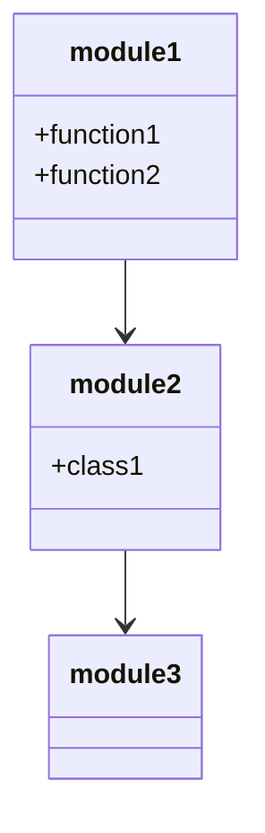
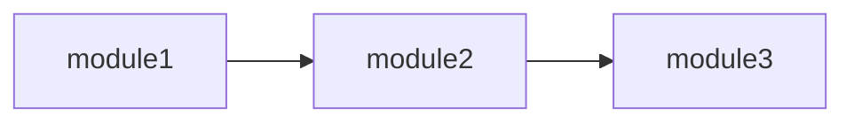
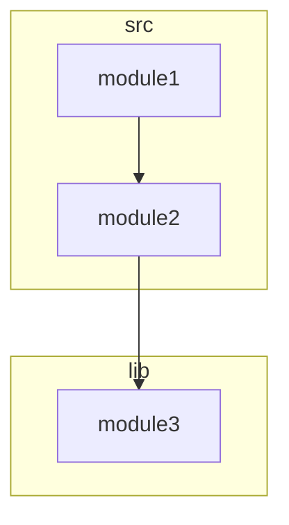

# Mermaid Generator Documentation

This document provides detailed information about the Mermaid diagram generation system in the codebase-scribe-ai project.

## Overview

The Mermaid Generator is responsible for creating Mermaid diagram syntax for architecture visualization. It takes a NetworkX directed graph representing code dependencies and generates various types of Mermaid diagrams that can be embedded in markdown documentation.

## Architecture

The Mermaid Generator is implemented in `src/generators/mermaid.py` and follows a modular design:

```
src/generators/mermaid.py
```

## Key Components

### Main Class

```python
class MermaidGenerator:
    def __init__(self, graph: nx.DiGraph, direction: str = "LR", sanitize_nodes: bool = True):
        # Initialize with a dependency graph and configuration options
```

This is the main class for Mermaid diagram generation. It takes a NetworkX directed graph and optional configuration parameters.

### Diagram Generation Methods

The class provides three main diagram generation methods:

1. **generate_class_diagram**: Generates a class diagram showing module relationships and exports
2. **generate_dependency_flowchart**: Generates a flowchart showing module dependencies
3. **generate_package_diagram**: Generates a package diagram showing directory-level dependencies
4. **generate_all_diagrams**: Convenience method that generates all three diagram types at once

### Helper Methods

The class includes helper methods for diagram generation:

1. **_sanitize_node_name**: Sanitizes node names for Mermaid compatibility

## Usage

The MermaidGenerator is typically used through the architecture generator:

```python
from src.generators.mermaid import MermaidGenerator

# Create a MermaidGenerator with a dependency graph
mermaid = MermaidGenerator(analyzer.graph, direction="TB", sanitize_nodes=True)

# Generate a class diagram
class_diagram = mermaid.generate_class_diagram()

# Generate a dependency flowchart with custom direction
dependency_flowchart = mermaid.generate_dependency_flowchart(custom_direction="LR")

# Generate a package diagram
package_diagram = mermaid.generate_package_diagram()

# Generate all diagrams at once
all_diagrams = mermaid.generate_all_diagrams()
```

## Configuration Options

The MermaidGenerator supports several configuration options:

1. **direction**: The default direction for flowcharts (TB, LR, RL, BT)
   - TB: Top to bottom
   - LR: Left to right
   - RL: Right to left
   - BT: Bottom to top

2. **sanitize_nodes**: Whether to sanitize node names for Mermaid compatibility
   - When enabled, special characters in node names are replaced with underscores
   - This ensures valid Mermaid syntax regardless of input node names

3. **custom_direction**: Override the default direction for specific diagrams
   - Can be specified per diagram generation method
   - Allows different directions for different diagram types

## Error Handling

The MermaidGenerator implements comprehensive error handling:

- Input validation in the constructor
- Try/except blocks in all diagram generation methods
- Graceful handling of empty graphs
- Proper error messages in the output when generation fails

## Testing

The MermaidGenerator has comprehensive tests in `tests/test_mermaid.py` that cover:

- Initialization and validation
- Node name sanitization
- Class diagram generation
- Dependency flowchart generation
- Package diagram generation
- Multiple diagram generation
- Empty graph handling
- Error handling

## Example Outputs

### Class Diagram



### Dependency Flowchart



### Package Diagram



## Integration with Architecture Generator

The MermaidGenerator is now used in a hybrid approach with the LLM:

1. The architecture generator builds a dependency graph from the file manifest
2. This graph is passed to the MermaidGenerator to create component diagrams
3. The generated diagrams are inserted into the LLM-generated architecture content
4. This ensures that even if the LLM doesn't generate diagrams, the architecture documentation will still include visual representations

This approach combines the strengths of both systems:
- The LLM provides rich textual descriptions and analysis
- The MermaidGenerator provides consistent and accurate visual diagrams

### Current Implementation

```python
# Build a dependency graph from the file manifest
dependency_graph = build_dependency_graph_from_manifest(file_manifest)

# Create MermaidGenerator with the dependency graph
mermaid_gen = MermaidGenerator(dependency_graph)

# Generate a dependency flowchart
diagram = mermaid_gen.generate_dependency_flowchart()

# Insert the diagram into the LLM-generated content
if diagram and "```mermaid" in diagram:
    # Add the diagram before the first section or at the end if no sections
    if "## " in architecture_content:
        parts = architecture_content.split("## ", 1)
        architecture_content = parts[0] + "\n" + diagram + "\n\n## " + parts[1]
    else:
        architecture_content += "\n\n" + diagram
```

### Java Project Support

The MermaidGenerator has been enhanced to better support Java projects with deep package structures:

1. The `build_dependency_graph_from_manifest` function analyzes Java package structures
2. It identifies components based on package naming conventions
3. It creates relationships between components based on common Java architectural patterns
4. This results in more meaningful component diagrams for Java projects

### Path Compression Integration

The MermaidGenerator works seamlessly with the path compression system:

1. File paths are compressed to reduce token usage when sending to the LLM
2. The MermaidGenerator operates on the original, uncompressed paths
3. This ensures accurate diagram generation while still benefiting from token savings

For more details on the architecture generation process, see the [Architecture Generator Documentation](ARCHITECTURE_GENERATOR.md).

## Extending

To extend the MermaidGenerator:

1. Add new diagram types by creating methods similar to the existing ones
2. Add new node sanitization rules in the `_sanitize_node_name` method
3. Add new configuration options to the constructor
4. Update the `generate_all_diagrams` method to include new diagram types