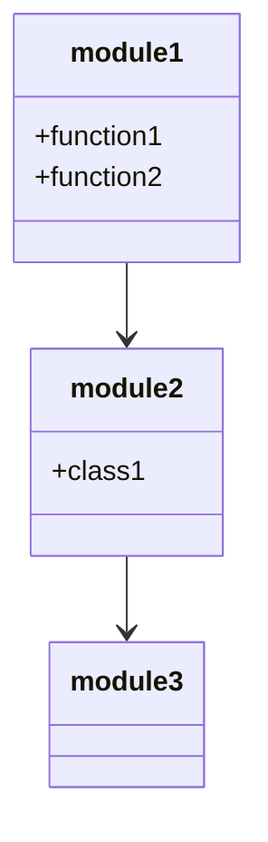
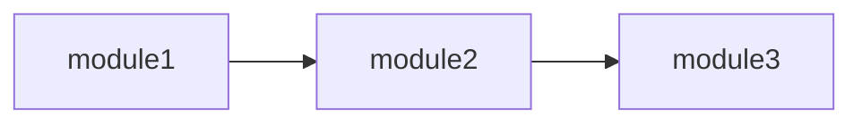
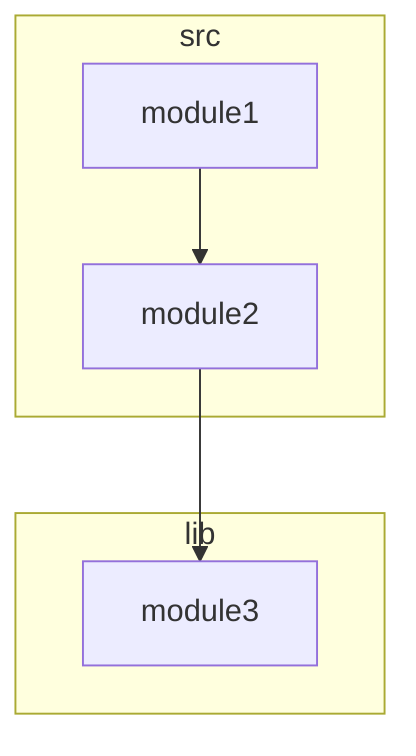

# Mermaid Generator Documentation

This document provides detailed information about the Mermaid diagram generation system in the codebase-scribe-ai project.

## Overview

The Mermaid Generator is responsible for creating Mermaid diagram syntax for architecture visualization. It takes a NetworkX directed graph representing code dependencies and generates various types of Mermaid diagrams that can be embedded in markdown documentation.

## Architecture

The Mermaid Generator is implemented in `src/generators/mermaid.py` and follows a modular design:

```
src/generators/mermaid.py
```

## Key Components

### Main Class

```python
class MermaidGenerator:
    def __init__(self, graph: nx.DiGraph, direction: str = "LR", sanitize_nodes: bool = True):
        # Initialize with a dependency graph and configuration options
```

This is the main class for Mermaid diagram generation. It takes a NetworkX directed graph and optional configuration parameters.

### Diagram Generation Methods

The class provides three main diagram generation methods:

1. **generate_class_diagram**: Generates a class diagram showing module relationships and exports
2. **generate_dependency_flowchart**: Generates a flowchart showing module dependencies
3. **generate_package_diagram**: Generates a package diagram showing directory-level dependencies
4. **generate_all_diagrams**: Convenience method that generates all three diagram types at once

### Helper Methods

The class includes helper methods for diagram generation:

1. **_sanitize_node_name**: Sanitizes node names for Mermaid compatibility

## Usage

The MermaidGenerator is typically used through the architecture generator:

```python
from src.generators.mermaid import MermaidGenerator

# Create a MermaidGenerator with a dependency graph
mermaid = MermaidGenerator(analyzer.graph, direction="TB", sanitize_nodes=True)

# Generate a class diagram
class_diagram = mermaid.generate_class_diagram()

# Generate a dependency flowchart with custom direction
dependency_flowchart = mermaid.generate_dependency_flowchart(custom_direction="LR")

# Generate a package diagram
package_diagram = mermaid.generate_package_diagram()

# Generate all diagrams at once
all_diagrams = mermaid.generate_all_diagrams()
```

## Configuration Options

The MermaidGenerator supports several configuration options:

1. **direction**: The default direction for flowcharts (TB, LR, RL, BT)
   - TB: Top to bottom
   - LR: Left to right
   - RL: Right to left
   - BT: Bottom to top

2. **sanitize_nodes**: Whether to sanitize node names for Mermaid compatibility
   - When enabled, special characters in node names are replaced with underscores
   - This ensures valid Mermaid syntax regardless of input node names

3. **custom_direction**: Override the default direction for specific diagrams
   - Can be specified per diagram generation method
   - Allows different directions for different diagram types

## Error Handling

The MermaidGenerator implements comprehensive error handling:

- Input validation in the constructor
- Try/except blocks in all diagram generation methods
- Graceful handling of empty graphs
- Proper error messages in the output when generation fails

## Testing

The MermaidGenerator has comprehensive tests in `tests/test_mermaid.py` that cover:

- Initialization and validation
- Node name sanitization
- Class diagram generation
- Dependency flowchart generation
- Package diagram generation
- Multiple diagram generation
- Empty graph handling
- Error handling

## Example Outputs

### Class Diagram



### Dependency Flowchart



### Package Diagram



## Integration with Architecture Generator

The MermaidGenerator was previously used directly by the architecture generator to create visual representations of the codebase structure. In the current implementation, the LLM is responsible for generating the architecture content, including any Mermaid diagrams.

The architecture generator now focuses on:
1. Coordinating with the LLM to generate content
2. Formatting and validating the generated content
3. Providing fallback mechanisms when LLM generation fails

For more details on the architecture generation process, see the [Architecture Generator Documentation](ARCHITECTURE_GENERATOR.md).

### Historical Reference (Previous Implementation)

For reference, this is how the MermaidGenerator was previously used:

```python
# Create MermaidGenerator with appropriate configuration
mermaid = MermaidGenerator(
    analyzer.graph,
    direction=DEFAULT_DIAGRAM_DIRECTION,
    sanitize_nodes=True
)

# Generate diagrams
package_diagram = mermaid.generate_package_diagram(custom_direction=DEFAULT_DIAGRAM_DIRECTION)
dependency_flowchart = mermaid.generate_dependency_flowchart(custom_direction=DEPENDENCY_DIAGRAM_DIRECTION)
class_diagram = mermaid.generate_class_diagram()
```

## Extending

To extend the MermaidGenerator:

1. Add new diagram types by creating methods similar to the existing ones
2. Add new node sanitization rules in the `_sanitize_node_name` method
3. Add new configuration options to the constructor
4. Update the `generate_all_diagrams` method to include new diagram types