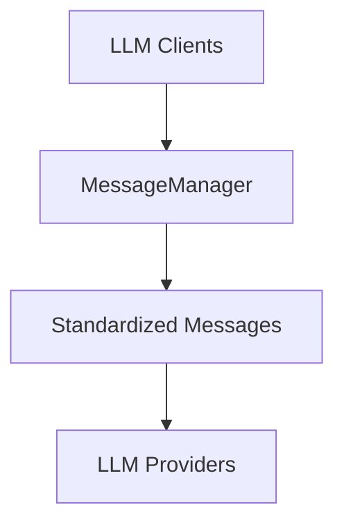

# Message Manager

This document provides detailed information about the `MessageManager` class used in the Codebase Scribe AI project.

## Overview

The `MessageManager` class is a utility class that standardizes message formatting for different LLM providers. It provides a centralized place to define system and user prompts for various documentation generation tasks, ensuring consistency across the application.



## Key Features

- Version tracking for API compatibility
- Input validation for all parameters
- Comprehensive documentation with examples
- Type hints for better IDE support
- Multi-stage token reduction strategy
- Final class design (not meant to be subclassed)

## Core Methods

```python
@final
class MessageManager:
    """
    Manages message formatting for different LLM providers.
    
    This class provides a centralized place to define system and user prompts
    for different LLM interactions, ensuring consistency across the application.
    All methods are static and should not be overridden.
    """
    
    VERSION = "1.0.0"
    
    @staticmethod
    def create_system_user_messages(system_content: str, user_content: str) -> List[Dict[str, str]]:
        """Create standard system and user messages."""
        # Implementation details...
```

### Base Message Creation

The core method of the `MessageManager` class is `create_system_user_messages`, which creates a standard pair of system and user messages for LLM requests:

```python
@staticmethod
def create_system_user_messages(system_content: str, user_content: str) -> List[Dict[str, str]]:
    """
    Create standard system and user messages.
    
    This is the core method used by all other methods to create properly
    formatted message pairs for LLM requests.
    
    Args:
        system_content: Content for the system message that sets context and instructions
        user_content: Content for the user message that contains the specific request
        
    Returns:
        A list of message dictionaries formatted for LLM API requests
    """
    # Validate inputs
    if not isinstance(system_content, str) or not system_content.strip():
        raise ValueError("System content must be a non-empty string")
    if not isinstance(user_content, str) or not user_content.strip():
        raise ValueError("User content must be a non-empty string")
        
    return [
        {"role": "system", "content": system_content},
        {"role": "user", "content": user_content}
    ]
```

### Specialized Message Creation

The `MessageManager` class provides specialized methods for creating messages for different documentation tasks:

- `get_project_overview_messages`: Creates messages for project overview generation
- `get_component_relationship_messages`: Creates messages for component relationship analysis
- `get_file_summary_messages`: Creates messages for file summary generation
- `get_architecture_content_messages`: Creates messages for architecture documentation
- `get_enhance_documentation_messages`: Creates messages for enhancing existing documentation
- `get_usage_guide_messages`: Creates messages for usage guide generation
- `get_contributing_guide_messages`: Creates messages for contributing guide generation
- `get_license_info_messages`: Creates messages for license information generation
- `get_file_order_messages`: Creates messages for file order optimization

### Token Management

The `MessageManager` class includes a sophisticated token management system that can handle oversized inputs:

```python
@staticmethod
def check_and_truncate_messages(messages: List[Dict[str, str]], token_counter: TokenCounter, model_name: str) -> List[Dict[str, str]]:
    """
    Check if messages exceed token limit and truncate if needed.
    
    This method implements a multi-stage token reduction strategy:
    1. First attempts intelligent content reduction that preserves important information
    2. If still over limit, falls back to hard truncation of user messages
    
    The system message is preserved as much as possible since it contains critical
    context and instructions, while user messages are prioritized for truncation.
    """
    # Implementation details...
```

## Usage Examples

### Basic Usage

```python
# Create a simple message pair
messages = MessageManager.create_system_user_messages(
    "You are a helpful assistant.",
    "Explain Python decorators."
)

# Generate a file summary
file_content = "def hello():\n    print('Hello world')"
messages = MessageManager.get_file_summary_messages(file_content)
```

### Project Documentation

```python
# Generate project overview messages
messages = MessageManager.get_project_overview_messages(
    project_structure="src/\n  main.py\n  utils.py",
    tech_report="Python 3.9\nRequirements: requests, numpy",
    template_content="Generate a README for this project"
)

# Generate architecture documentation messages
messages = MessageManager.get_architecture_content_messages(
    project_structure="src/\n  main.py\n  utils.py",
    key_components="Main module, Utils module",
    tech_report="Python 3.9\nRequirements: requests, numpy"
)
```

### Token Management

```python
# Check and truncate messages if they exceed token limits
messages = [
    {"role": "system", "content": "You are a helpful assistant."},
    {"role": "user", "content": "Very long content..."}
]
truncated_messages = MessageManager.check_and_truncate_messages(
    messages, token_counter, "gpt-4"
)
```

## Integration with LLM Clients

The `MessageManager` class is used by the LLM client implementations (`BedrockClient` and `OllamaClient`) to format messages for LLM requests. This centralization ensures consistency in message formatting across different LLM providers.

```python
# In BedrockClient
messages = MessageManager.get_file_summary_messages(prompt)
response = await self._invoke_model_with_token_management(messages)

# In OllamaClient
messages = MessageManager.get_component_relationship_messages(
    self.project_structure,
    tech_report
)
response = await self.client.chat(
    model=self.selected_model,
    messages=messages,
    options={"temperature": self.temperature}
)
```

## Testing

The `MessageManager` class has comprehensive unit tests in `tests/test_message_manager.py` that cover all methods and various edge cases, including:

- Basic functionality tests
- Input validation tests
- Token truncation tests with different scenarios
- Error handling tests

## Best Practices

When using the `MessageManager` class, follow these best practices:

1. Always validate inputs before passing them to the `MessageManager` methods
2. Handle exceptions that may be raised by the `MessageManager` methods
3. Use the appropriate specialized method for each documentation task
4. Use the `check_and_truncate_messages` method to handle token limits
5. Do not subclass the `MessageManager` class (it is marked as `@final`)